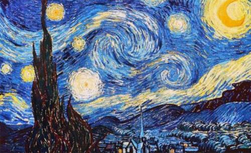
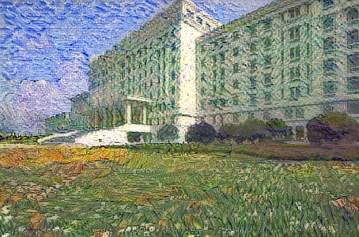
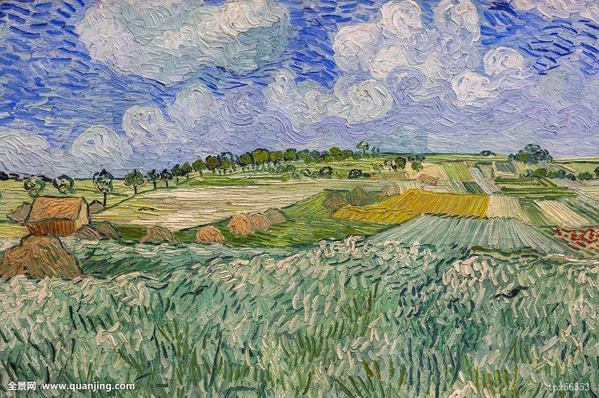
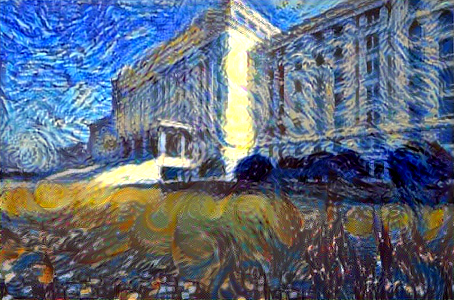
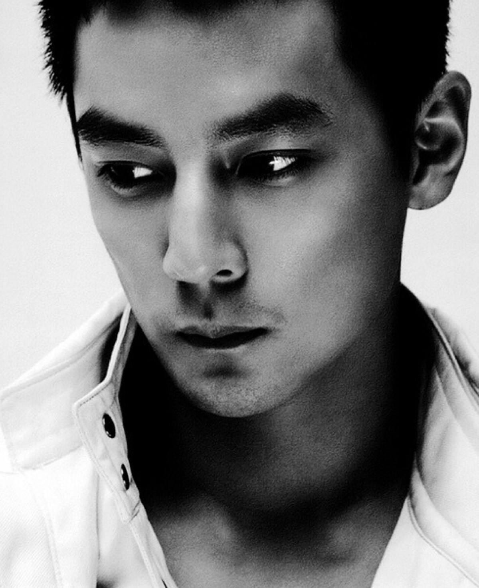
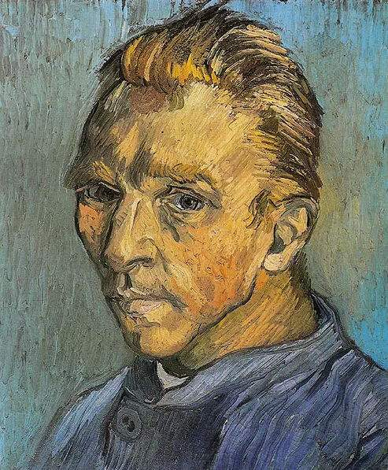
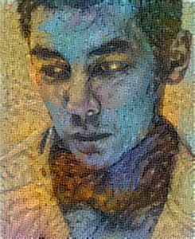

# My Neural Transfer
A simple practice of neural style transfer

This code is just for neural style transfer test based on Keras `neural_style_transfer.py`,
and the original Keras project please click [here](https://github.com/keras-team/keras)！

## Environments

- Linux Ubuntu 16.04 + Intel Core i7 + GTX960M(渣本)
- Anaconda3 + Tensorflow 1.2 + Keras 2.0

## Running

`python my_neural_style_transfer.py <origin image file path> <style image file path> <output image file path>`
Use `--iter` to change the number of iterations(default 10).
Use `--content_weight` to change the the weight of content loss(default 0.025).
Use `--style_weight` to change the the weight of style loss(default 1.0).

## Results

The basic results are as follow(the subgraph from left to right is the origin image, style image and 
stylized image respectively):

The second experiment try to use two style images to stylize the origin image at the same time,
the results are as follow：

