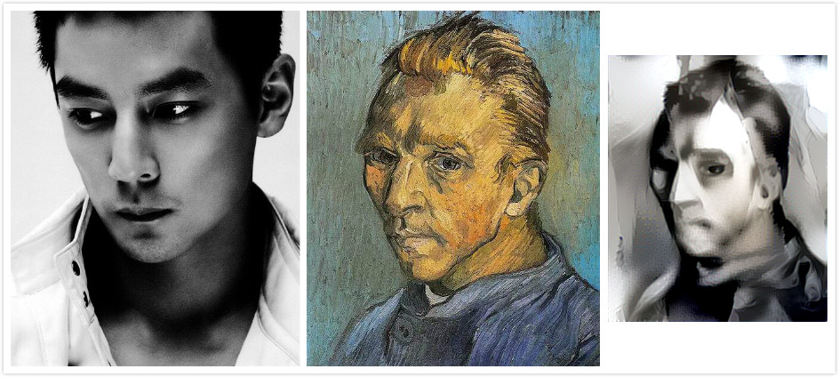

# My Neural Transfer
A simple practice of neural style transfer

This code is just for neural style transfer test based on Keras `neural_style_transfer.py`,
and the original Keras project please click [here](https://github.com/keras-team/keras)！

## Environments

- Linux Ubuntu 16.04 + Intel Core i7 + GTX960M(渣本)
- Anaconda3 + Tensorflow 1.2 + Keras 2.0
- Pre-trained VGG19 network (content feature layer is `[block5_conv2]`, style feature layer 
is ['block1_conv2', 'block2_conv2', 'block3_conv2', 'block4_conv2', 'block5_conv2'])

## Running

`python my_neural_style_transfer.py <origin image file path> <style image file path> <output image file path>`

Use `--iter` to change the number of iterations(default 10).

Use `--content_weight` to change the the weight of content loss(default 0.025).

Use `--style_weight` to change the the weight of style loss(default 1.0).

Use '--style2_reference_image_path' to get combine style result

## Results

The basic results are as follow(the subgraph from left to right is the origin image, style image and 
stylized image respectively):

The second experiment try to use two style images to stylize the origin image at the same time,
the results are as follow：

these results show that the style will diffused into the whole origin image, but not 
the left style diffuse to the left part of the origin image and so on.

The final result is trying to transfer the normal image style to thr artistic image, gives the result:

## References

- [A Neural Algorithm of Artistic Style](https://arxiv.org/pdf/1508.06576v2.pdf)
- [Keras project](https://github.com/keras-team/keras)

